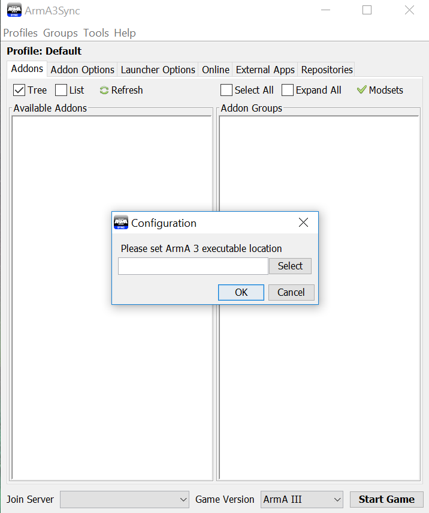
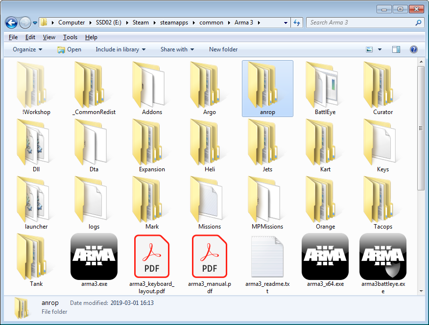
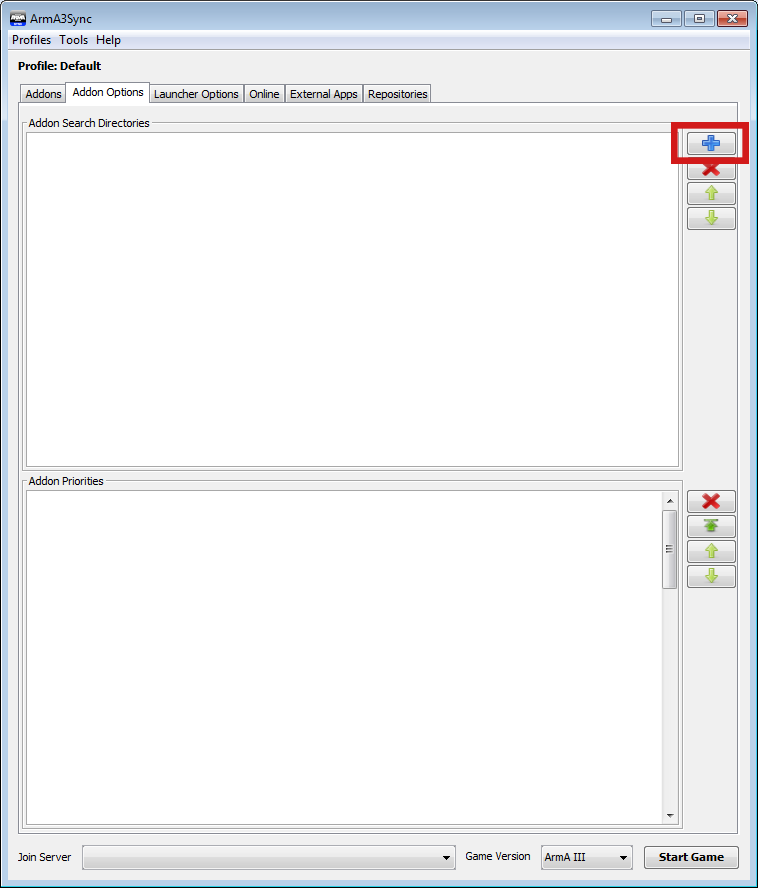
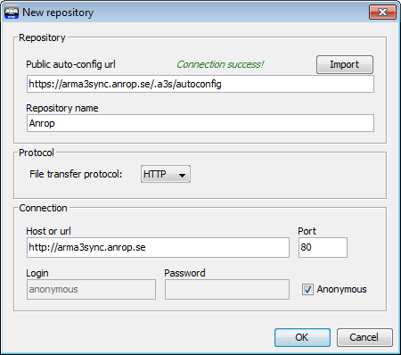
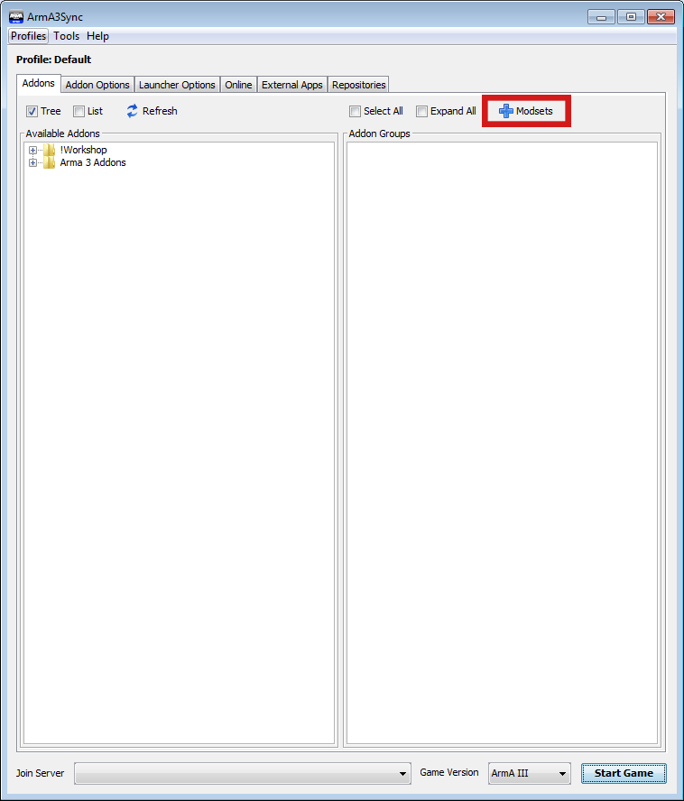
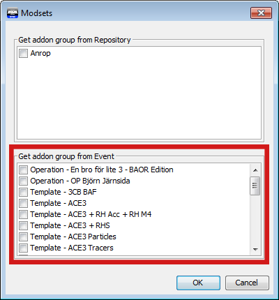
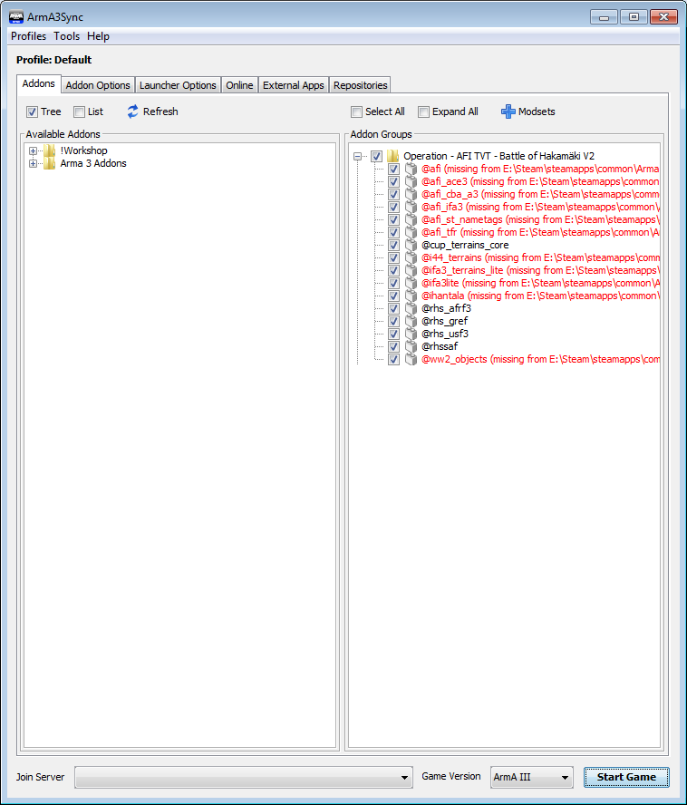
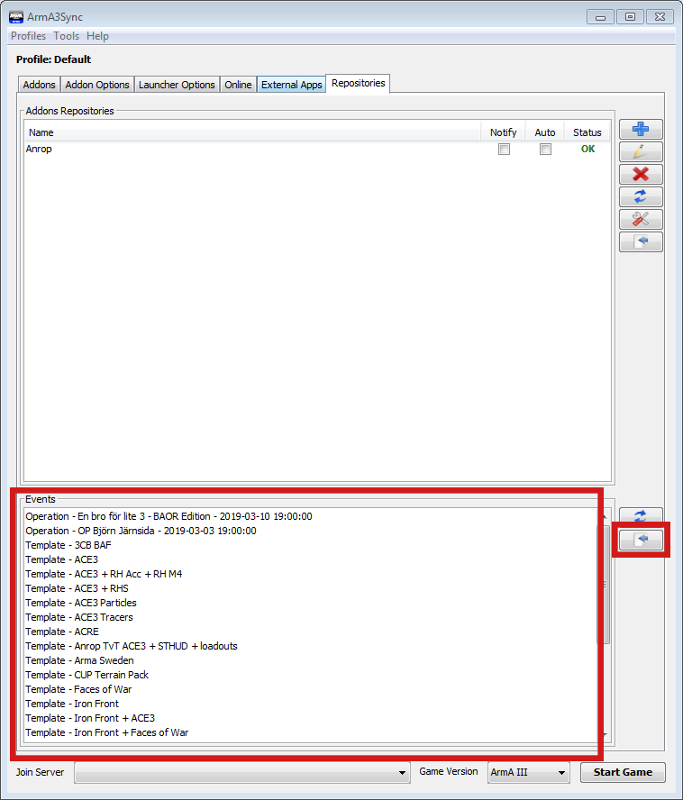
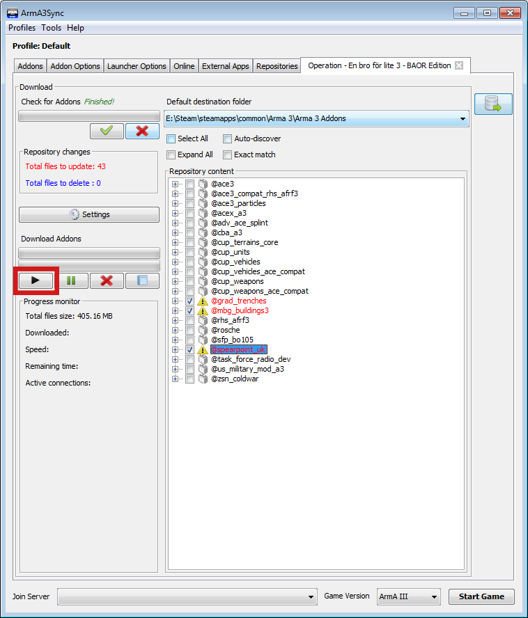

# Arma3Sync

## Vad är Arma3Sync

Arma3Sync är ett kraftfullt launcherprogram för Arma 3 med stöd för användande av grupper av modifikationer, så kallade `modset`.  
Modset kan definieras av användaren eller av eventarrangörer, och enskilda modset kan nyttjas oberoende av varandra.

En enskild modifikation kallas i dagligt tal `addon` eller `mod` (`addons` respektive `moddar` i plural) oavsett om den ingår i en grupp eller ej.  
Ett exempel på en mod är [Swedish Forces Pack (SFP)](https://sfp.anrop.se/).

Arma3Sync förenklar kraftigt nedladdning av moddar från olika källor, dessa källor kallas `repositories`.  

Anrops Arma3Sync-repository är integrerat med eventsidorna på [Anrop.se](https://www.anrop.se).  
Det innebär att du kan söka i antingen det fullständiga repositoryt som innehåller *alla* moddar som för närvarande hostas där, eller eventspecifika subrepositories som *endast* innehåller de moddar som är aktuella för ett specifikt event.

Detta betyder att du **INTE** behöver ladda ner *allt* som finns i Anrops repository, utan *bara det som behövs* för att delta i specifika event.

## Varför Arma3Sync

Arma3Sync lämpar sig väl för användare som vill ha bättre kontroll över när moddar laddas ner eller uppdateras, till var de laddas ner, och varifrån de laddas in i spelet.  
I de sammanhang som Anrop spelar underlättar Arma3Sync markant jämfört med manuell hantering av moddar eller att använda Steams workshop och den vanliga Arma 3-launchern.

Arma3Sync kan dessutom använda olika nedladdningskällor - d.v.s. flera olika repositories - och det är möjligt att strikt kontrollera vilka versioner av enskilda moddar som finns tillgängliga, motsvarande funktionalitet finns inte i den vanliga Arma 3-launchern.

Ett antal andra funktioner finns utöver de som nämns i denna guide men de skiljer sig inte nämnvärt från vad som erbjuds i den vanliga Arma 3-launchern.

## Installera Arma3Sync

### Steg 1

[Ladda ner Arma3Sync genom att klicka på denna länk](https://hosted.anrop.se/arma3sync.exe), kör installationsprogrammet och starta Arma3Sync när installationen är färdig.

Du kommer då se följande fönster som ber om sökvägen till din Arma 3-installation.

Hitta mappen där du installerat Steam, därifrån är sökvägen till Arma 3-mappen följande:  
`\Steam\steamapps\common\Arma 3\`

### Steg 2

Innan du gör något annat måste du bestämma var moddarna ska laddas ner till.

Öppna `Windows Utforskare (Explorer)` och navigera till där du installerat Arma 3.  
I Arma 3-mappen: skapa en mapp och döp den till `anrop`.  
Det är till denna map som du kommer att ladda ner moddar.

**OBS! Rör inga andra mappar eller filer i Arma 3-mappen!**

### Steg 3

Gå tillbaka till Arma3Sync-fönstret och byt till fliken `Addon Options`.

Klicka på det blåa plustecknet på högersidan.

I menyn som öppnas ska du navigera till mappen du nyss skapade, välja den, och klicka på `Open`.

Nu har du valt till vilken mapp du ska ladda ner moddar, dags att välja varifrån du ska ladda ner dem!

## Anslut till Anrops Repository

Gå till fliken `Repositories` i Arma3Sync-fönstret och klicka på det blå plustecknet till höger.

I fönstret som öppnas klistrar du in följande adress i fältet `Public auto-config url` och klickar sedan på knappen märkt `Import`:  
`https://arma3sync.anrop.se/.a3s/autoconfig`

Detta skapar ett bokmärke till Anrops repository, nu är du redo att hämta modset!

## Lägg till Modset

### Steg 1

Byt till fliken `Addons` i Arma3Sync-fönstret.

Till vänster, under `Available Addons`, visas de moddar som du laddat ner till `anrop`-mappen.  
Till höger, under `Addon Groups` visas de grupper av addons som hör till event, eller som du skapat själv.  
Det är dessa grupper som vi i dagligt tal kallar `modset`, i bemärkelsen "ett events modset".

För att hämta det modset som hör till ett event klickar du på det blåa plustecknet märkt `Modsets` ovanför `Addon Groups`-sektionen.

I fönstret som öppnas, under `Get addon group from Event`, välj det eller de event vars modset du vill hämta.  
Klicka sen på `OK` för att hämta det eller de modset du valt.

### Steg 2

Modseten som du hämtade dyker nu upp i sektionen `Addon Groups`.  
För att ett modset ska laddas när spelet startas måste du kryssa i rutan till vänster om dess mappikon.

Kryssa i rutan för att välja modsetet, sen klickar du på plustecknet till vänster om kryssrutan för att expandera det.  
Nu ser du att de moddar som är del av modsetet listas med röd istället för svart text.  
Det innebär att de inte ännu finns i din `anrop`-mapp.

För att lösa det måste du ladda ner dem, mer om det i nästa steg.

## Ladda ner moddar

### Steg 1

I Arma3Sync-fönstret går du till fliken `Repositories`, längst ner finns en lista med event, hitta det event du vill delta på i listan.

Markera eventet genom att klicka på det, klicka sedan på knappen med en blå pil på ett dokument till höger om listan för att ansluta till eventets repository.

### Steg 2

Nu har du de moddar som krävs för eventet framför dig.

Textfärgen och ikonen visar tillsammans status för de olika moddarna.  
Alla moddar som du inte redan laddat ner kommer att visas med röd text, och de som behöver uppdateras har en varningsskylt som ikon.  
Har en mod både röd text och varningsskylt har den inte laddats ner än.

För att ladda ner moddar väljer du först alla som du vill ladda ner.  
Du gör det antingen genom att kryssa i rutan till vänster om moddarnas ikoner, eller genom att kryssa i `Select All` i menyn ovanför listan.

**OBS! Du ska under INGA omständigheter ansluta till huvudrepositoryt och kryssa i Select All!**  
**Gör du det riskerar du att ladda ner flera hundra Gigabyte moddar!**

Klicka nu på `Start`-knappen (playikonen) till vänster om listan för att starta nedladdningen av de valda moddarna.

### Steg 3

När nedladdningen är färdig är du redo att delta i det event vars modset du valt och de tillhörande moddar som du laddat ner!

Kolla i `Addons`-fliken en sista gång för att säkerställa att du valt rätt modset att starta spelet med, och klicka sedan på `Start Game`.
