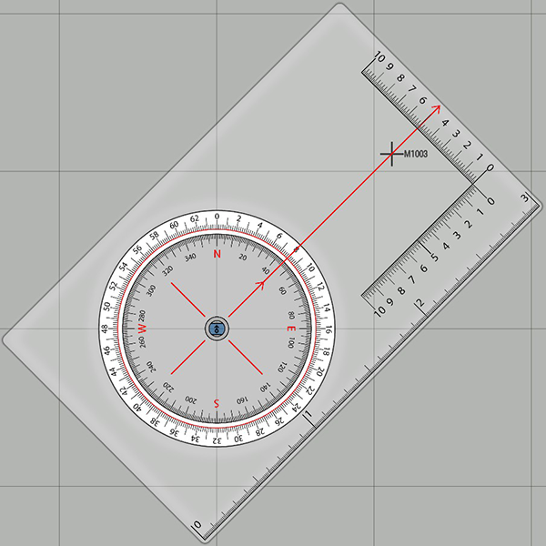
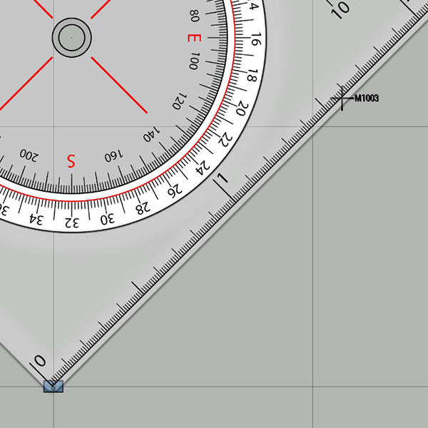
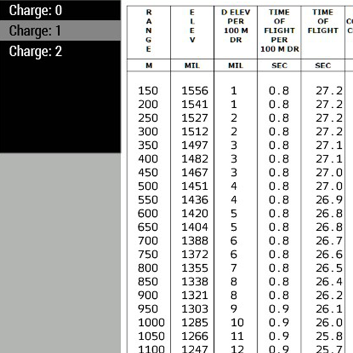
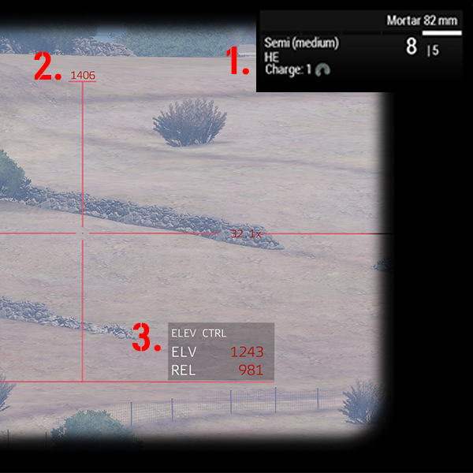

# Granatkastare

## Introduktion

Denna guide går igenom grunderna samt några mer avancerade tips för bruket av granatkastare i Arma.  

*Den ursprungliga textförfattaren - Taltsi från Arma Finland - tjänstgjorde som granatkastargruppchef i den Finska armén, och har anpassat vad han lärde sig där till Arma med hjälp av ett flertal andra spelare.*

## Grunder

Syftet med granatkastare är att understödja infanterienheter genom indirekt eld.  

I Arma monteras granatkastare isär till två delar (ryggsäckar): eldrör och markplatta.  
För att montera granatkastaren måste du ha en av ryggsäckarna på dig, och den andra på marken framför dig. 

Granatkastarnas eld leds av en eldledare, det är av yttersta vikt att eldledaren och granatkastargruppchefen är överens om t.ex. vad "3 granater" innebär i eldsignaleringssammanhang.  
Normen är att varje pjäs skjuter det angivna antalet granater.

En granatkastare hanteras av en grupp soldater, också kallad granatkastarservis.  
En servis ingår oftast i en granatkastarpluton, som kan bestå av följande:

#### Gruppchef

Leder en granatkastarservis eller en pluton bestående av flera granatkastarserviser.  
Gruppchefen tar emot eldsignaleringar från eldledaren och kommunicerar dessa till granatkastarserviserna.

Finns inga servischefer ansvarar gruppchefen för att beräkna värden för skyttarna.

#### Servischef

Tar emot order från gruppchefen och är normalt ansvarig för att beräkna värden för skytten som ingår i samma granatkastarservis.

#### Granatkastarskytt

Ställer in granatkastaren efter de värden han får från sin servischef.  
Skjuter med granatkastaren, och håller räkningen på antal granater som skjutits.

#### Laddare

Laddar granatkastaren, håller koll på hur mycket ammunition till granatkastaren som finns kvar.

### Val av Pjäsplats

Säkerställ vid val av pjäsplats för granatkastarna att det inte finns några hinder som träd, byggnader, et.c. framför eldröret.

Pjäsplatsen bör vara så platt som möjligt, för att undvika obehagliga buggar, speciellt med granatkastare från diverse modifikationer.

## Beräkna Inställningar

Det finns flera sätt att räkna ut pjäsernas inställningsvärden för ett mål.  
I denna guide täcker vi hur du använder Map Tools och Range Table från ACE, eftersom de är de mest grundläggande verktygen.

Till att börja med måste du känna till din egen position så exakt som möjligt, se till att nyttja alla tillgängliga verktyg för att fastställa den.

### Riktning

Öppna din karta och ta fram dina Map Tools genom ACEs självinteraktionsmeny.  
Placera centrumpunkten på gradskivan på din egen position, och rotera sedan skivan så att riktningsindikatorn sammanfaller med målets koordinater.

Den yttre ringen är graderad i hundratals mils.  
Läs av den för att få fram **riktningen i mils**.

### Avstånd

Använd skalan på kanten av dina Map Tools för att mäta avståndet till målet.  
I bilden är målet cirka 1570m från pjäsplatsen, en noggranhet på 50m är godtagbar, såpass små mätfel kan lätt lösas genom eldreglering.

### Laddning och Elevering

När du mätt avståndet läser du ut den laddning och elevering som krävs.  
Normalt sett behöver du enbart bry dig om de två första kolumnerna i tabellen: `Range` och `Elev`.

Höjdskillnad täcks i den avancerade delen av guiden.

## Direktriktad Eld

Granatkastarna är oftast grupperade såpass långt från frontlinjen att alla mål måste rapporteras in av eldledaren.  
Det innebär förstås inte att en granatkastarpluton inte kan agera som en självständig eldenhet, till exempel om:

- Målet är synligt från pjäsplatsen.
- Något landmärke i närheten av målet är tydligt synligt från pjäsplatsen.
- Det går att se målet från en position i närheten av pjäsplatsen.

I dessa situationer mäts riktningen med en granatkastares sikte, med en avståndsmätare, eller från en kompass vars mått omvandlas till mils med hjälp av Map Tools.  
Avstånd till målet kan fås genom avståndsmätare, Map Tools, eller genom uppskattning (MAS-formeln, under avancerade tips).

## Att Skjuta

Denna del av guiden går igenom förfaranden vid eldgivning i strid.

### Ställa In Granatkastaren

Att ställa in granatkastaren är relativt enkelt, du behöver endast hålla reda på följande tre element i granatkastarens sikte:

| Element | Vad | Justeras Hur |
| --- | --- | --- |
| 1. | Laddning (charge) och ammunitionsmängd. | **F** cyklar mellan 0-1-2 laddningar |
| 2. | Riktningsvisare i mils. | Rör musen i sidled. |
| 3. | Elevering, endast raden `ELV` är relevant. | **Page Up/Page Down**, håll ner **Vänster Shift** för att justera långsammare. |

### Spridning

Eld från granatkastare har minimal naturlig spridning i Arma, och en 82mm sprängvinggranat har en effektiv radie på som mest 50 meter, vilket innebär att elden måste spridas manuellt.

Det finns flera sätt att göra det, spridningen bestäms av grupp/servischefen eller begärs uttryckligen av eldledaren.  
Som granatkastargruppchef bör du se till att diskutera spridning med eldledaren under briefingen innan uppdragets start.

#### Naturling Spridning

Spridning av elden uppnås genom att gruppera granatkastarna med ett fast avstånd mellan dem, till exempel 30 meter.  
På så vis kommer deras granater slå ner 30 meter isär om de har samma inställningar vid eldgivning.  
Eftersom alla pjäser skjuter med samma inställningar är detta det absolut enklaste och mest pålitliga sättet att sprida nedslagen utan något extra arbete.

#### Gruppspridning

Spridning uppnås genom att hela granatkastargruppen sprider sina skott med samma värden, till exempel:

- 1a skottet i angiven riktning
- 2a skottet +20 mils till angiven riktning
- 3e skottet -20 mils från angiven riktning  
Och så vidare.

#### Individuell Spridning

Varje enskild pjäs skjuter med en individuell justering, till exempel:

- 1a pjäs lägger till 20 mils till angiven riktning
- 2a pjäs drar bort 20 mils från angiven riktning
- 3e pjäs alternerar mellan ±5 mils i elevering varje skott

#### Spridning av Mål

Varje pjäs får egna målkoordinater och skjutinställningar, till exempel två ändar och mitten av ett fält.  
Denna metod är mödosam att använda, men granaterna kan fås att landa exakt där du vill ha dem.

#### Självspridning

Varje pjäs sprider på eget bevåg inom angivna ramar.  
Till exempel ±40 mils från angiven riktning, eller ±10 mils i elevering.

## Eldsignalering

Eldsignalering används för att rapportera in och begära eldgivning mot mål.  
Det utgörs av fyra olika kommandon, och innehåller information om målets position, typ av granat som ska användas, samt antal granater som ska avfyras.

### Grundläggande Struktur

Grupp- eller servischef tar emot eldsignaleringsmeddelanden från eldledaren,  antecknar informationen från det och börjar beräkna pjäsinställningarna.  

När chefen är färdig meddelar han värdena till pjäserna, och antecknar dem för framtida bruk.  

När alla pjäser är redo ger chefen eldkommando och meddelar eldledaren att pjäserna öppnat eld.

### Förfarande

Fyra olika kommandon används, för en grundlig genomgång se [Eldledarguiden](../../guides/eldledning/).

1. För att *registrera* ett mål
2. För att *rikta* pjäserna mot ett mål
3. För att *skjuta* på ett mål
4. För att *reglera* elden mot ett mål efter föregående skjutning

#### Exempel på Eldsignalering

| Avsändare | Meddelande |
| --- | --- |
| Eldledaren | Adam Johan från Erik Kalle, Eldsignalering. Kom |
| Gruppchef | Adam Johan, Eldsignalering. Kom |
| Eldledaren | Adam Johan från Erik Kalle, Eldsignalering! F2 Öst 50, 3 Spräng, Eld. Kom |
| Gruppchef | Adam Johan, F2 Öst 50, 3 Spräng. Kom |
| Eldledaren | Korrekt |
| : | _Gruppchefen beräknar inställingar och instruerar skyttarna._ |
| : | _När pjäserna öppnar eld  rapporterar han till eldledaren._ |
| Gruppchef | Adam Johan, Fyr. Kom |
| : | Eldledaren reglerar sedan elden efter behov |

### Intern Kommunikation

Pjäsinställningarna kommuniceras i följande ordning:

1. Laddning
2. Riktning
3. Elevering

Som skytt, efter att du ställt in din granatkastare, läs värderna från din granatkastares sikte och kvittera med din servis- eller gruppchef för att säkerställa att de är korrekta.

Först efter att du kvitterat får du eldkommando.

#### Exempel på Intern Kommunikation

| Avsändare | Meddelande |
| --- | --- |
| Gruppchef | Eldsignalering! |
| Servischefer/Skyttar | Eldsignalering! |
| : | _Gruppchefen beräknar inställningarna._ |
| Gruppchef | Laddning 1, Riktning 14-3-5 (fjorton-tre-fem), elevering 12-6-7 (tolv-sex-sju) |
| : | Skyttarna antecknar värdena och ställer in sina pjäser |
| 1a skytt | 1a pjäs redo! Laddning 1, Riktning 14-3-5, elevering 12-6-7 |
| 2a skytt | 2a pjäs redo! Laddning 1, Riktning 14-3-5, elevering 12-6-7 |
| : | _o.s.v. tills alla pjäser är redo_ |
| Gruppchef | Korrekt, 3 Spräng, ELD! |
| : | _Skyttarna börjar skjuta, när de är klara rapporterar de än en gång till chefen._ |
| 1a skytt | 1a pjäs, skjutit 3 spräng! |
| 2a skytt | 2a pjäs, skjutit 3 spräng! |
| Gruppchef | Uppfattat, eld upphör. |

### Hur Säger Man Mils?

De första två siffrorna sägs som ett tal, de sista två individuellt:

| Riktning | Sägs |
| --- | --- |
| 5055 | Femtio-fem-fem |
| 5555 | Femtiofem-fem-fem |
| 5005 | Femtio-noll-fem |
| 555 | Fem-fem-fem |

## Måltabell

Måltabellen används för att spara värden och beteckning på olika mål.  
Det är starkt rekommenderat att både grupp-/servischefer och skyttar för måltabell.

Måltabellen gör det enkelt att registrera mål och hålla reda på hur många granater som skjutits.  
Det enda som krävs är ett papper eller motsvarande att anteckna på.

Måltabellen för du på följande vis:

| Mål | Laddning | Riktning | Elevering | Antal granater |
| --- | --- | --- | --- | --- | --- |
| M1001 | 2 | 1337 | 1270 | 3 Spräng |
| M1002 | 3 | 4711 | 1117 | 6 Rök |
| etc | : | : | : | : |

## Avancerade Tips & Trick

### MAS-formeln

Denna enkla formel har ett oändligt antal användningsområden.

Du kan till exempel beräkna spridning med den: 2 meters spridning vid 1 kilometers avstånd motsvarar 2 mils vid granatkastaren.

### Höjdskillnad

Den tredje kolumnen i ditt Range Table visar hur mycket du måste ändra elevering per 100 meter i höjdskillnad från pjäsplatsen.

Till exempel

- Pjäsplatsen ligger 50 m.ö.h., målet ligger 100 m.ö.h., avståndet är 1000m.
- Med en laddning får vi eleveringen 1285 mils, och `D ELEV PER 100M DR` på 10 mils.
- Eftersom målet ligger högre än pjäsplatsen kommer vi att skjuta kort utan korrigering.  
Vi måste alltså minska eleveringen med `( 50/100 == 0.5 ) x 10 == 5` mils.

Notera att -5 mils är en oansenlig skillnad i elevering, vilket innebär att det inte är lönt att justera pjäserna exakt om det inte är av yttersta vikt att träffa rätt med den första salvan.

#### Tumregler

- OM MÅLET ÄR HÖGRE: DRA IFRÅN
- OM MÅLET ÄR LÄGRE: LÄGG TILL
