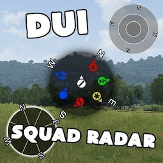

# Client Side

Följande moddar behöver bara köras av spelaren och inte av servern.
De är tillåtna på Anrops event men inte nödvändigtvis på externa event.

## DUI Squad Radar

[DUI Squad Radar](https://steamcommunity.com/workshop/filedetails/?id=1638341685) lägger till en radar som visar medlemmar i din grupp som är nära dig.

## JSRS

JSRS förbättrar markant ljudeffekterna i spelet jämfört med standardljuden.

För flera modifikationer behövs en extra modul för att ljuden ska bytas ut.

### CUP

För CUP behöver du motsvarande JSRS-modul för att ändra alla vapenljud

* [JSRS CUP Weapons](https://steamcommunity.com/sharedfiles/filedetails/?id=1624803912)
* [JSRS CUP Vehicles](https://steamcommunity.com/sharedfiles/filedetails/?id=1624804924)

### RHS

För RHS behöver du motsvarande JSRS-modul för att ändra alla vapenljud

* [JSRS RHS AFRF](https://steamcommunity.com/sharedfiles/filedetails/?id=945476727)
* [JSRS RHS GREF](http://steamcommunity.com/sharedfiles/filedetails/?id=1180534892)
* [JSRS RHS SAF](http://steamcommunity.com/sharedfiles/filedetails/?id=1486541773)
* [JSRS RHS USAF](https://steamcommunity.com/sharedfiles/filedetails/?id=1180533757)

### SFP

[SFP JSRS](https://steamcommunity.com/sharedfiles/filedetails/?id=1205570929)

För FFP behövs även [FFP JSRS](https://steamcommunity.com/sharedfiles/filedetails/?id=1220451406)
