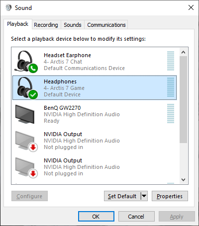
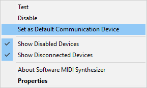
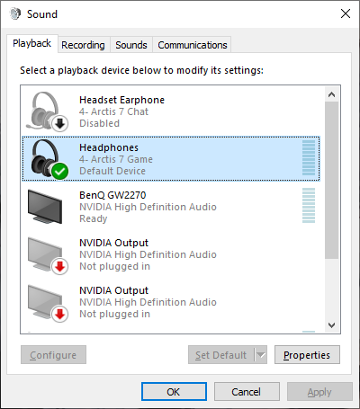

# Hjälp, Arma 3 krashar!

Arma är en komplex bjässe som har en tendens att inte alltid göra det man vill eller förväntar.
Ofta leder detta till buggigt beteende, men ibland krashar spelet även till skrivbordet (eng. crash to desktop, "CTD") utan någon form av felmeddelanden.

I syfte om att underlätta felsökandet indexeras på denna sida kända problem och symptom som leder till att spelet krashar, samt hur man åtgärdar det.

## Jag använder ett Steelseries Arctis 7 och har ljudproblem, därefter CTD

### Symptom
Ljudeffekter som exempelvis motorljud hörs inte.
Kort därefter fryser spelet och CTD.

### Förklaring
Drivrutinerna för hörlurarna exponerar två separata ljudkanaler: ett för spel (i stereo) och ett för VOIP (i mono).
Detta för att man ska kunna justera balansen mellan kanalerna via potentiometern på höger lurs baksida.
Till denna mono-kanal tilldelas även ACRE/TFAR via Teamspeak, varför positionellt ljud inte fungerar.
Separationen till två kanaler är inte heller något Arma 3 i kombination med ACRE/TFAR gillar, varför eventuell CTD.

### Lösning
Ljudkällorna som spelas upp genom monokanalen måste flyttas till stereokanalen.
Öppna upp kontrollpanelen för ljudenheter via Win + R och exekvera `control mmsys.cpl sounds`.
Du kommer presenteras med en konfiguration likt bilden nedan.

Du vill se till att stereokanalen används som standardenhet för alla ljudkällor.
Gör detta genom att klicka i "Set as Default Communication Device" i högerklicksmenyn nedan.
Det skadar inte heller att avaktivera monokanalen via "Disable".

När du är klar vill du att kontrollpanelen ser ut som nedan.

Efter detta kommer inte potentiometern ha någon effekt på balansen mellan spel- och VOIP-ljud.
Den kommer istället endast kontrollera ljudnivån, likt potentiometern på vänster lurs baksida.

Windows kan slumpmässigt återställa dessa inställningar.
